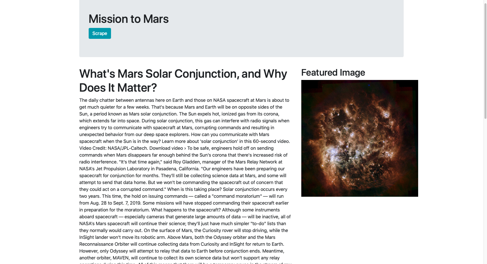
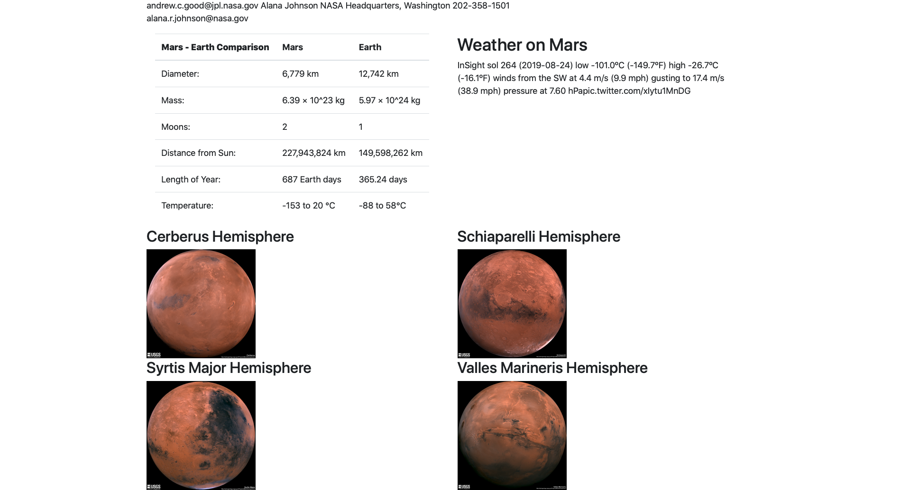

# mars-facts-web-scraping

Full Stack Project that uses flask and mongodb to display facts about Mars from nasa.gov, twitter, and space-facts.com.

Shows the featured image and news article from nasa.gov

shows a facts table from space-facts.com, the mars weather report form twitter, and high quality images of the hemispheres of mars(if you look closely you might see Dr. Manhattan)

